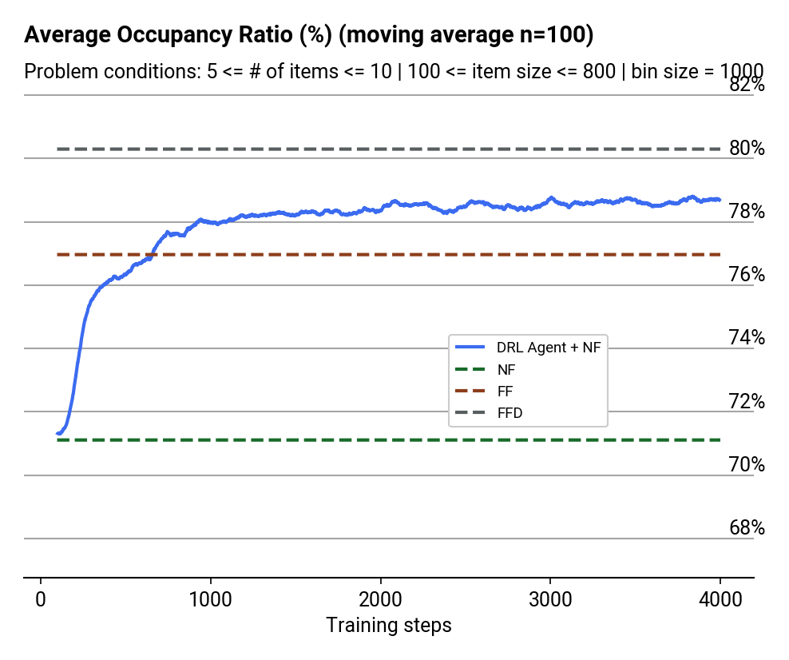
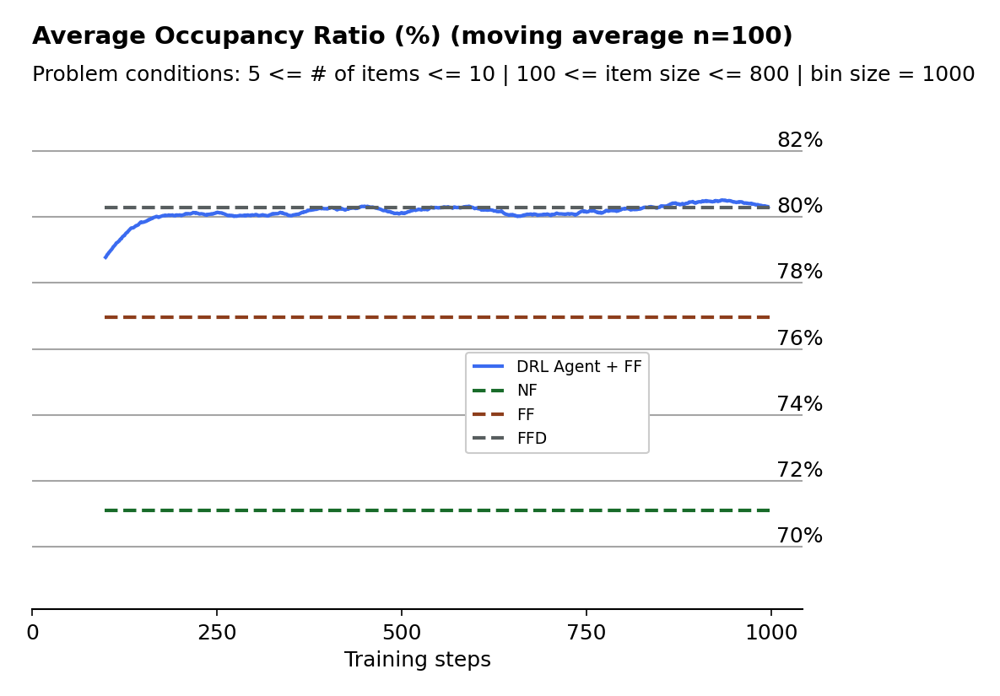

Solve the [1D Bin Packing Problem](https://en.wikipedia.org/wiki/Bin_packing_problem) 
using Deep Reinforcement Learning and Pointer Networks.

This PyTorch implementation solves the version of the problem where a set of items of varying sizes
must be packed into the minimum number of bins possible. The bins have all the same size.

The DRL algorithm is based on the approach from [Bello et al](https://arxiv.org/pdf/1611.09940.pdf) 
to solve the Travelling Salesman Problem. With some adaptations to make it work for the 
bin packing problem.

In my approach, the sequence that is output by the model is interpreted as the order in 
which the items must be packed in the bins. The packing is then performed either 
following a FF or a NF heuristic (whatever is set in the config). The reward is the 
average occupancy of the bins in %. The agent learns to not only pack items of varying 
size in the best possible way, but also it can learn to deal with a variable number of 
items (i.e. the same DNN can be used ot allocate a set of 10 items than a set of 30 items, 
as long as both sizes are considered during training).

This implementation also compares the results of using the DRL approach 
with those that would have been obtained by following a Next-Fit, First-Fit and 
First-Fit-Decreasing heuristic. 

# Usage

## Install required libraries

```
pip install requirements.txt
```

## Train the agent

Problem conditions can be set via the default values in [config.py](src/config.py) or as 
arguments at runtime. This impact the sets of items that the agent sees during training.

The maximum number of items (`max_num_items`) must match the maximum number that the 
agent will see during inference, since it impacts the architecture.

The rest of parameters (e.g. `max_item_size`) is not mandatory that they match those seen
in inference but the results will be much better if it does. 

So for example, the two models saved in `./experiments/models` has been trained with the below 
conditions (plus all the defaults in the `config.py`) 

Using a **Next-Fit** heuristic to pack the items in the order given by the pointer network:

```
python3 src/main.py --min_item_size 100 --max_item_size 800 --min_num_items 5 --max_num_items 10 --bin_size 1000 --agent_heuristic NF --model_path ./experiments/models/policy_dnn_100_800_5_10_1000_NF.pkl
```

Results:

<center></center>


Using a **First-Fit** heuristic to pack the items in the order given by the pointer network:

```
python3 src/main.py --min_item_size 100 --max_item_size 800 --min_num_items 5 --max_num_items 10 --bin_size 1000 --agent_heuristic FF --model_path ./experiments/models/policy_dnn_100_800_5_10_1000_FF.pkl
```

Results:

<center></center>


## Run inference on sets of items

The model from the example above could then be used to pack the sets of items in 
`inference_data\input_states.txt` by running:


# Further work


